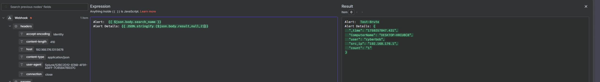
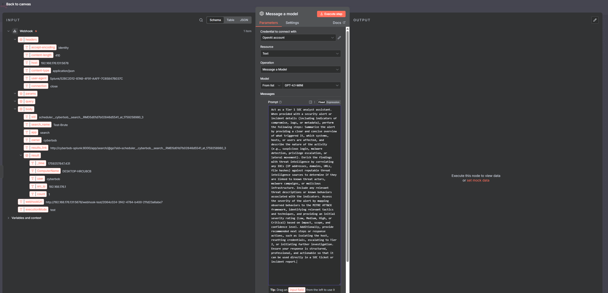

# 🧠 SOC Automation Lab – Part 2: Automated Alert Enrichment & Slack Notifications
**By Allante Johnson (CyberBob)**

---

## 🧭 Overview
In **Part 2** of the SOC Automation Lab, we expanded our automation pipeline by integrating **Slack** with **n8n** to deliver enriched security alerts directly to a Slack channel. This step transforms Splunk alerts into actionable, context-rich messages for analysts, providing immediate visibility and triage information.

We also integrated the **AbuseIPDB API** to enrich IP addresses found in alerts with threat intelligence data, such as confidence scores, categories, and geographic details.

---

## 🧰 Components Used
| Component | Purpose |
|-----------|----------|
| 🧠 **n8n** | Automation orchestrator to receive, process, and enrich Splunk alerts |
| 💬 **Slack** | Notification channel for enriched alert messages |
| 🌐 **AbuseIPDB** | Threat intelligence source for IP enrichment |
| 🧾 **Splunk Webhook Alerts** | Source of alert data pushed into n8n |

---

## ⚙️ Workflow Summary

### 1. 🌐 **Webhook Input**
Splunk alert data is sent to n8n via a **Webhook node**, containing JSON fields such as:
```json
{
  "search_name": "Test-Brute",
  "ComputerName": "DESKTOP-HRCU8CB",
  "user": "cyberbob",
  "src_ip": "192.168.176.1",
  "count": 1
}
```

✅ **Screenshot:**  
  


---

### 2. 🤖 **GPT Analysis Node**
The data is passed into an **OpenAI Message Node** (GPT-4 Mini), using the Tier 1 SOC Analyst Assistant prompt from Part 1, with structured output requirements.

🧠 **Prompt Used:**
> Act as a Tier 1 SOC analyst assistant...  
> Format output clearly – Return findings in a structured format (**Summary**, **IOC Enrichment**, **Severity Assessment**, **Recommended Actions**).

✅ **Screenshot:**  


---

### 3. 🌍 **IP Enrichment via AbuseIPDB**
To simulate a real-world enrichment process, we **hard-coded a test IP** (e.g., `167.99.186.73`) into the workflow instead of using local private IPs. The IP was then enriched using the **AbuseIPDB API**, retrieving details like confidence score, country, ISP, and activity type.

✅ **Screenshots:**  
  
  


---

### 4. 💬 **Slack Notification**
The enriched and formatted alert was posted to the **#alerts** Slack channel with the following structure:

✅ **Example Message:**  


**Summary:**  
A brute-force alert “Test-Brute” was detected involving host **DESKTOP-HRCU8CB** and user **cyberbob**. The IP address **167.99.186.73** was identified and enriched.

**IOC Enrichment:**  
- IP: 167.99.186.73  
- Abuse Confidence Score: 90 (High)  
- Country: Canada  
- ISP: DigitalOcean  
- Category: Port Scanning, Brute Force  
- Last Reported: 2025-09-30

**Severity Assessment:**  
- MITRE ATT&CK Tactics:  
  - TA0001: Initial Access (Brute Force)  
  - TA0043: Reconnaissance (Scanning)  
- Severity: High  

**Recommended Actions:**  
1. Block IP `167.99.186.73` at the firewall.  
2. Review login attempts on `DESKTOP-HRCU8CB`.  
3. Escalate to Tier 2 for further investigation.  
4. Verify user account `cyberbob` and enforce MFA.  

---

## 🧠 Outcome
This automation now provides:
- 🚨 **Real-time alert delivery** into Slack  
- 🌍 **Threat intel enrichment** for external IPs  
- 🧱 **Actionable triage data** with severity and MITRE mapping  
- 🧩 **Foundation for future response workflows** (e.g., blocking, ticket creation)

---

## 📂 Repository Structure
```
SOC-Automation-Lab/
│
├── README-Part2.md
└── screenshots/
    ├── n8n connected.png
    ├── prompt.png
    ├── selecting IP to hard code.png
    ├── api key abuse.png
    ├── IP enchriment.png
    ├── alert in slack.png
    └── jsoncreated.png
```

---

## 🚀 Next Steps
- 🧠 Automate AbuseIPDB lookups dynamically from incoming IPs  
- 🧰 Add VirusTotal and WHOIS enrichment  
- 📣 Create incident tickets automatically in Jira or ServiceNow  
- ⚡ Introduce containment actions (firewall rules, disabling users)

Stay tuned for **Part 3: Automated Response and Ticketing!**
